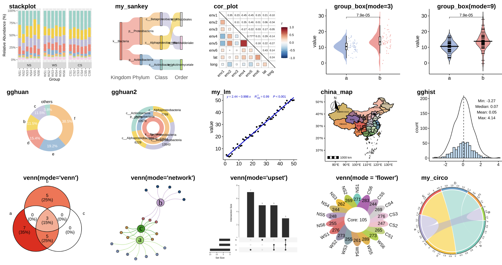

<!-- README.md is generated from README.Rmd. Please edit that file -->

```{r, include = FALSE}
knitr::opts_chunk$set(
  collapse = TRUE,
  comment = "#>",
  fig.path = "man/figures/README-",
  out.width = "100%"
)
devtools::load_all("~/Documents/R/pcutils/")
library(badger)
```

# pcutils 

<!-- badges: start -->
[](https://github.com/Asa12138/pcutils/actions/workflows/R-CMD-check.yaml)
`r badge_custom("blog", "@asa", "blue", "https://asa-blog.netlify.app/")`
`r badge_cran_download("pcutils", type = "grand-total")`
`r badge_cran_download("pcutils", type = "last-month")`
`r badge_cran_release("pcutils","green")`
`r badge_devel("Asa12138/pcutils", color = "green")`
<!-- badges: end -->

pcutils is a package that contains some useful functions for me, it offers a range of utilities and functions for everyday programming tasks. 

The HTML documentation of the latest version is available at [Github page](https://asa12138.github.io/pcutils/).

## Installation

The stable version is available on CRAN:

```
install.packages("pcutils")
```

Or you can install the development version of pcutils from [GitHub](https://github.com/) with:

``` r
# install.packages("devtools")
devtools::install_github("Asa12138/pcutils")
```

## Little tools

-   `lib_ps`, `del_ps` can library or detach packages gracefully

-   `dabiao` print a message `dabiao("Message",char = "😀",n = 20)`: 😀😀😀😀😀😀Message😀😀😀😀😀😀

-   `copy_vector` help to copy a vector, like `datapasta` package; `copy_df` help to copy a dataframe

-   `change_fac_lev` can change a factor levels; `tidai` can replace a vector by named vector

-   `update_param` update a parameter in a function

-   `sanxian` print a three-line table

-   `grepl.data.frame` and `gsub.data.frame` do grepl and gsub on a dataframe.

### for file

-   `read.file` read some special format files

-   `trans_format` convert file format like jpg, png, svg, pdf, html...

-   `read_fasta` and `write_fasta` read and write fasta file

### for web

-   `download2` download a file from a url

-   `search_browse` search and browse a website

-   `translator` translate a text


## Statistics

### data preprocessing

-   `remove.outliers` remove the outliers

-   `count2` imitate the `uniq -c` in shell

-   `hebing` group your dataframe; `guolv` filter a dataframe; `rm_low` remove low frequency

-   `trans` transfer your data

-   `mmscale` do a scale specifying the min and max

-   `strsplit2` is better than `strsplit` for me; `t2` is better than `t` for me

-   `explode` expand a column in dataframe; `squash` squash a dataframe

-   `pre_number_str` prepare a number string

### statistical test

-   `twotest` do a two-group test and `multitest` do a multi-group test; `group_test` performs multiple mean comparisons for a data.frame

-   `fittest` test a vector fit which distribution

-   `toXY` transfer geographical latitude and longitude to XY(m)

-   `lm_coefficients` get the coefficients of a linear model; `multireg` fit a multiple linear model

## Visualization

### utils for plot

-   `rgb2code` convert between r,g,b and color code; `is.ggplot.color` judge a right color; `add_alpha` add a alpha for a color

-   `plotpdf`, `plotgif` print pdf or gif for a plot list

-   `get_cols` generate n colors based on a palette; `scale_fill_pc` and `scale_color_pc` are scales for ggplot

-   `add_theme` generate a mytheme object for ggplot

-   `legend_size` resize the legend for a ggplot; `ggplot_lim` get the x-y limits for a ggplot

-   `generate_labels` generate points position for a series of labels

-   `ggplot_translator` translate the text of a ggplot

### plot functions

```{r include=FALSE,eval=FALSE}
p1 <- stackplot(hebing(otutab, taxonomy$Class, 1, act = "sum"), metadata, group = "Group", style = "sample") +
  scale_fill_pc() + theme(legend.position = "none")
cbind(taxonomy, num = rowSums(otutab))[10:15, c(1:4, 8)] -> test
p1_1 <- my_sankey(test, "gg", num = FALSE, space = 1e4)
p2 <- cor_plot(metadata[, 3:10])
a <- data.frame(value = c(rnorm(50, 10, 3), rnorm(50, 13, 5)))
p3 <- group_box(a, group = rep(c("a", "b"), each = 50), p_value2 = T, mode = 3) +
  scale_color_pc(palette = "col3") + scale_fill_pc(palette = "col3") +
  mytheme + theme(legend.position = "none")
p4 <- group_box(a, group = rep(c("a", "b"), each = 50), p_value2 = T, mode = 9) +
  scale_color_pc(palette = "col3") + scale_fill_pc(palette = "col3") +
  mytheme + theme(legend.position = "none")

(p5 <- gghuan(data.frame(type = letters[1:6], num = c(1, 3, 3, 4, 5, 10))) + scale_fill_pc() + xlim(0, 3.7))
(p6 <- gghuan2(test[, c(1:3, 5)]) + scale_fill_pc() + xlim(0, 5))
(p7 <- my_lm(c(1:50) + runif(50, 0, 5), var = 1:50, lm_color = "blue3") + mytheme)
(p8 <- china_map(china_shp = "~/Documents/GitHub/Asa12138.github.io/FileList/china.json", text_param = list(size = 1.5)) +
  mytheme + labs(x = NULL, y = NULL) + theme(axis.text = element_text(size = 9)))
(p9 <- gghist(rnorm(500)) + labs(x = NULL))

aa <- list(a = 1:15, b = 13:20, c = 8:15)
p10 <- venn(aa, mode = "venn")
p11 <- ggplot() +
  theme_void() # venn(aa, mode = "network")
p12 <- ggplot() +
  theme_void() # venn(aa, mode = "upset")
p13 <- ggplot() +
  theme_void() # venn(otutab, mode = "flower")

p14 <- ggplot() +
  theme_void()
data.frame(
  a = c("a", "a", "b", "b", "c"),
  b = c("a", LETTERS[2:5]), c = 1:5
) %>% my_circo(mode = "circlize")


pdf("images/pcutils1.pdf", width = 20, height = 10)
cowplot::plot_grid(p1, p1_1, p2, p3, p4, p5, p6, p7, p8, p9, p10, p11, p12, p13, p14,
  ncol = 5, align = "hv",
  labels = c(
    "stackplot", "my_sankey", "cor_plot", "group_box(mode=3)", "group_box(mode=9)",
    "gghuan", "gghuan2", "my_lm", "china_map", "gghist",
    "venn(mode='venn')", "venn(mode='network')", "venn(mode='upset')", "venn(mode = 'flower')", "my_circo"
  ), scale = 0.9, label_size = 17
)
dev.off()
```



-   `stackplot` plot a bar plot or stack bar plot easily; `areaplot` plot a area plot easily

-   `my_sankey` plot a sankey plot

-   `cor_plot` plot a correlation plot

-   `group_box` plot a boxplot easily

-   `gghuan` plot a doughnut chart; `gghuan2` plot a multi-doughnut chart

-   `my_lm` fit a linear model and plot

-   `china_map` plot a china map; `sample_map` plot a sample map

-   `gghist` plot a histogram

-   `venn` plot a venn plot

-   `tax_pie` plot a pie plot

-   `tax_radar` plot a radar plot

-   `my_circo` plot a circlize plot

```{r include=FALSE,eval=FALSE}
cbind(taxonomy, num = rowSums(otutab))[1:10, c(2:4, 8)] -> test
my_sunburst(test)
my_circle_packing(test, show_level_name = F) + scale_color_pc("col3") +
  scale_fill_gradient(low = "white", high = "red3", na.value = NA)

cbind(taxonomy, num = rowSums(otutab))[1:10, c(4, 7, 8)] -> test
if (requireNamespace("treemap")) {
  my_treemap(test)
}
my_voronoi_treemap(test)
```


-   `my_sunburst` plot a sunburst plot

-   `my_circle_packing` plot a circle packing plot

-   `my_treemap` plot a treemap plot

-   `my_voronoi_treemap` plot a voronoi treemap plot

## Project

-   `make_project` build a R project

-   `add_analysis` create a specific Rmd file

-   `make_gitbook` build a git book

## Package

-   `prepare_package` prepare a package

-   `update_NEWS_md` update the NEWS.md

**Easter Egg**： `my_cat` will show my little cat named GuoDong.

