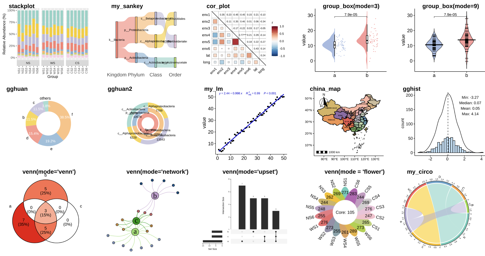
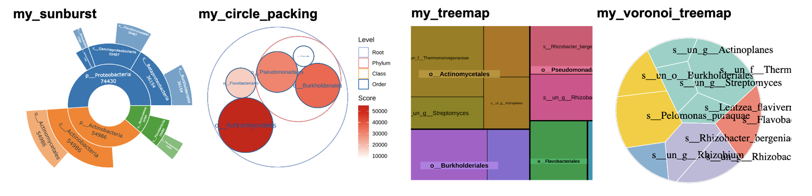

<!-- README.md is generated from README.Rmd. Please edit that file -->

# pcutils 

<!-- badges: start -->

[](https://github.com/Asa12138/pcutils/actions/workflows/R-CMD-check.yaml)
[](https://asa-blog.netlify.app/)
[](https://cran.r-project.org/package=pcutils)
[](https://cran.r-project.org/package=pcutils)
[](https://cran.r-project.org/package=pcutils)
[](https://github.com/Asa12138/pcutils)
<!-- badges: end -->

`pcutils` is a package that contains some useful functions for me, it
offers a range of utilities and functions for everyday programming
tasks.

The HTML documentation of the latest version is available at [Github
page](https://asa12138.github.io/pcutils/).

## Installation

The stable version is available on CRAN:

    install.packages("pcutils")

Or you can install the development version of `pcutils` from
[GitHub](https://github.com/) with:

``` r
# install.packages("devtools")
devtools::install_github("Asa12138/pcutils")
```

## Little tools

- `lib_ps`, `del_ps` can library or detach packages gracefully

- `dabiao` print a message `dabiao("Message",char = "😀",n = 20)`:
  😀😀😀😀😀😀Message😀😀😀😀😀😀

- `copy_vector` help to copy a vector, like `datapasta` package;
  `copy_df` help to copy a dataframe

- `change_fac_lev` can change a factor levels; `tidai` can replace a
  vector by named vector

- `update_param` update a parameter in a function

- `sanxian` print a three-line table

- `grepl.data.frame` and `gsub.data.frame` do grepl and gsub on a
  dataframe.

### for file

- `read.file` read some special format files

- `trans_format` convert file format like jpg, png, svg, pdf, html…

- `read_fasta` and `write_fasta` read and write fasta file

### for web

- `download2` download a file from a url

- `download_ncbi_genome_file` download a file from NCBI

- `search_browse` search and browse a website

- `translator` translate a text

## Statistics

### data preprocessing

- `remove.outliers` remove the outliers

- `count2` imitate the `uniq -c` in shell

- `hebing` group your dataframe; `guolv` filter a dataframe; `rm_low`
  remove low frequency

- `trans` transfer your data

- `mmscale` do a scale specifying the min and max

- `strsplit2` is better than `strsplit` for me; `t2` is better than `t`
  for me

- `explode` expand a column in dataframe; `squash` squash a dataframe

- `pre_number_str` prepare a number string

### statistical test

- `twotest` do a two-group test and `multitest` do a multi-group test;
  `group_test` performs multiple mean comparisons for a data.frame

- `fittest` test a vector fit which distribution

- `toXY` transfer geographical latitude and longitude to XY(m)

- `lm_coefficients` get the coefficients of a linear model; `multireg`
  fit a multiple linear model

## Visualization

### utils for plot

- `rgb2code` convert between r,g,b and color code; `is.ggplot.color`
  judge a right color; `add_alpha` add a alpha for a color

- `plotpdf`, `plotgif` print pdf or gif for a plot list

- `get_cols` generate n colors based on a palette; `scale_fill_pc` and
  `scale_color_pc` are scales for ggplot

- `add_theme` generate a mytheme object for ggplot

- `legend_size` resize the legend for a ggplot; `ggplot_lim` get the x-y
  limits for a ggplot

- `generate_labels` generate points position for a series of labels

- `ggplot_translator` translate the text of a ggplot

### plot functions



- `stackplot` plot a bar plot or stack bar plot easily; `areaplot` plot
  a area plot easily

- `my_sankey` plot a sankey plot

- `cor_plot` plot a correlation plot

- `group_box` plot a boxplot easily

- `gghuan` plot a doughnut chart; `gghuan2` plot a multi-doughnut chart

- `my_lm` fit a linear model and plot

- `china_map` plot a china map; `sample_map` plot a sample map

- `gghist` plot a histogram

- `venn` plot a venn plot

- `tax_pie` plot a pie plot

- `tax_radar` plot a radar plot

- `my_circo` plot a circlize plot



- `my_sunburst` plot a sunburst plot

- `my_circle_packing` plot a circle packing plot

- `my_treemap` plot a treemap plot

- `my_voronoi_treemap` plot a voronoi treemap plot

## Project

- `make_project` build a R project

- `add_analysis` create a specific Rmd file

- `make_gitbook` build a git book

## Package

- `prepare_package` prepare a package

- `update_NEWS_md` update the NEWS.md

**Easter Egg**： `my_cat` will show my little cat named GuoDong.
